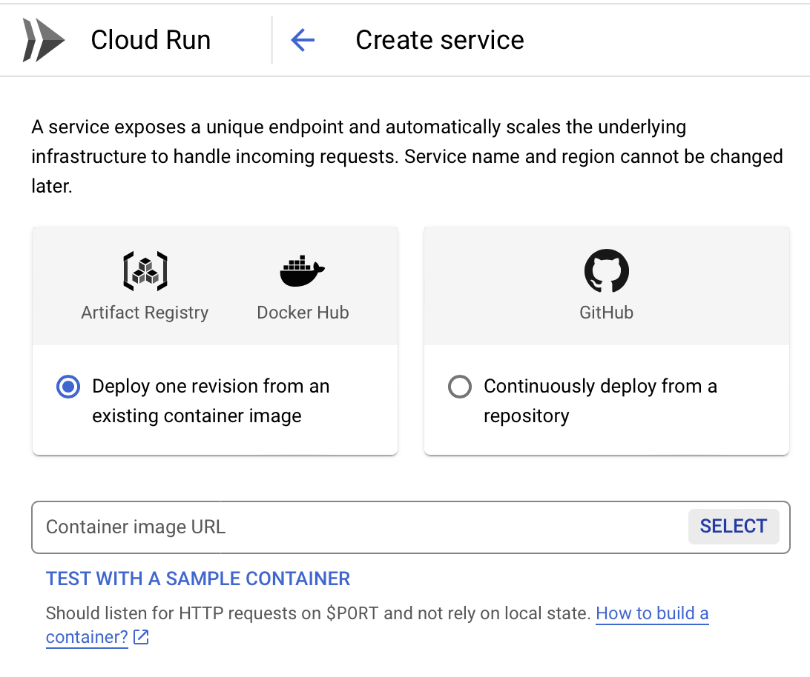
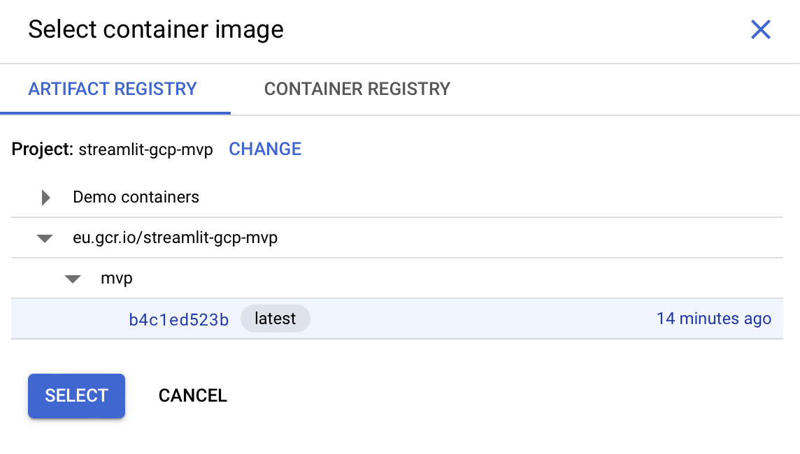

# MVP streamlit -> GCP

The most minimal example of a Streamlit app, containerized using Docker and deployed to GCP Cloud Run.

Date written: 23 July 2024

## Step-by-step reproduction

If you want to understand how to build this incrementally, here are the steps.

Note that these steps are ordered and should be done sequentially.

### 0️⃣ Pre-requisites

- [ ] Clone the repo.
- [ ] Install Docker.
- [ ] Create a python environment (e.g. use Conda).
- [ ] Run `pip install -r requirements.txt`.
  - Minimally, you should need to install `streamlit`.

### 1️⃣ Creating the Streamlit app

- [ ] Create a new Streamlit app. Here we built it in `app/app.py`.

### 2️⃣ Dockerize the app

- [ ] Create a `Dockerfile`
- [ ] Dockerize
  - [ ] Build the image: `docker build -t <image-name> .`
  - [ ] Run the container from image: `docker run <image-name>`
- [ ] Optionally, create a shell script that combines the dockerize step above. This is `dockerize.sh`

### 3️⃣ Pushing image to GCP Artifact Registry

- [ ] Create a GCP project
   - If you already have a GCP project, you might need to switch your project on the terminal. Run `gloud config set project <project-name>`.
- [ ] Activate the Artifact Registry API
   - Search the Artifact Registry on your GCP Cloud Console and click activate.
 - [ ] Dockerize
   - [ ] Identify the registry host: `eu.gcr.io`
   - [ ] Build the image: `docker build -t <registry-host>/<image-name> . --platform linux/amd64`
- [ ] Push the image to GCP Artifact Registry: `docker push <image-name>>`
- [ ] Optionally, create a shell script that combines the two steps above. This is `dockerize_gcp.sh`

### 4️⃣ Creating a GCP Cloud Run service

- [ ] Create a GCP Cloud Run service
  - This should automatically enable the Cloud Run service.
  - 
- [ ] Specify the `Container Image URL` to be the image that was pushed in the previous step.
  -   
- [ ] Choose your settings and click `CREATE`